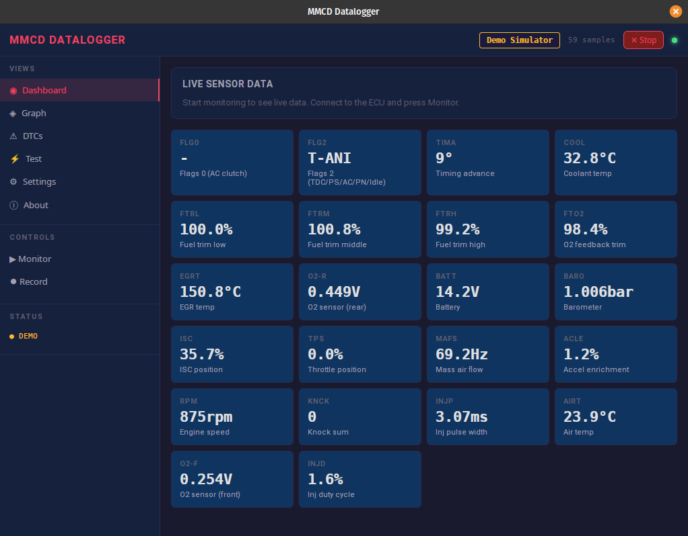
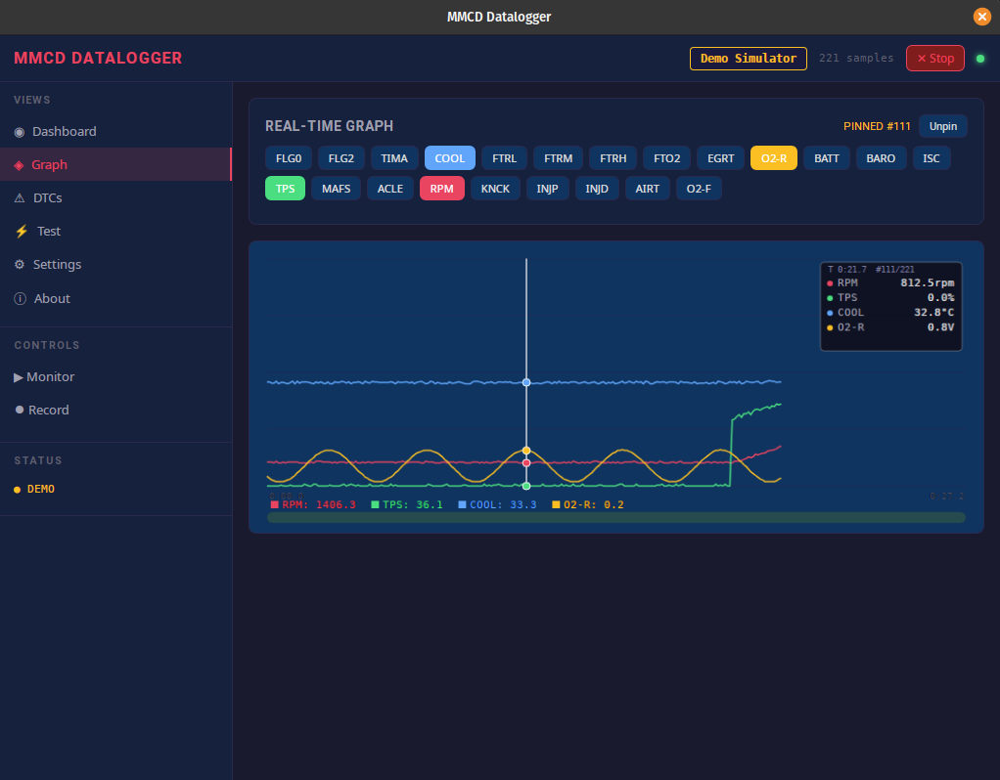

<p align="center">
  
</p>

# MMCD Datalogger

Cross-platform diagnostic and datalogging tool for pre-OBDII (1990–1994) Mitsubishi vehicles — Eclipse, Eagle Talon, Plymouth Laser, Galant (4G63).

A modern Go rewrite with both a **desktop GUI** (Wails v2 + Svelte) and a **headless CLI**.

## Features

### Desktop GUI
- **Three data source modes** — Live ECU, Demo Simulator, or Load Log File
- **Real-time dashboard** — Live sensor tiles for all 22 channels
- **Scrollable graph** — 30,000-sample deep history buffer with viewport scrolling
- **Sample-pinned crosshair** — Click to pin, arrow keys to step sample-by-sample, Escape to unpin
- **Elapsed time display** — Time shown on X axis and in crosshair readout panel
- **Draggable scrollbar** — Click, drag, or mouse wheel (vertical + horizontal) to navigate
- **Shared history** — Switch between Dashboard and Graph without losing data
- **Log file viewer** — Load and review CSV, .mmcd, or PalmOS PDB files directly in the graph
- **DTC read/erase** — Read active and stored diagnostic trouble codes
- **Actuator tests** — Fuel pump, purge solenoid, EGR, injector disable
- **CSV recording** — Record live data to timestamped CSV while monitoring
- **Demo mode** — Built-in ECU simulator with realistic driving scenarios (idle → accel → cruise → decel) for UI testing without hardware

### Headless CLI
- **Datalogging** — Log sensors to CSV with live terminal display
- **DTC diagnostics** — Read/erase trouble codes from the command line
- **Actuator testing** — Trigger solenoid tests over serial
- **Log import** — Convert PalmOS PDB files to CSV or native binary format
- **Log review** — Display saved logs in the terminal
- **Cross-platform** — Runs on Raspberry Pi, SSH sessions, or anywhere without a display

## Screenshots

### Dashboard — Live Sensor Tiles
<p align="center">
  
</p>

### Graph — Scrollable History with Crosshair
<p align="center">
  
</p>

## Download

Pre-built binaries are available on the [Releases](https://github.com/kevin-buckham/MMCd-Go/releases) page — no development tools required.

| File | Platform | Description |
|------|----------|-------------|
| `mmcd-desktop-darwin-universal.zip` | macOS (Intel + Apple Silicon) | Desktop app — unzip and run `mmcd.app` |
| `mmcd-desktop-linux-amd64.tar.gz` | Linux x86_64 | Desktop app — extract and run `./mmcd` |
| `mmcd-desktop-windows-amd64.exe` | Windows x86_64 | Desktop app — run directly |
| `mmcd-cli-*` | All platforms | Headless CLI (no GUI needed) |

## Quick Start (Developers)

### Prerequisites

- **[Go 1.22+](https://go.dev/dl/)**
- **[Node.js 18+](https://nodejs.org/)** (for frontend build)
- **[Wails CLI v2](https://wails.io/docs/gettingstarted/installation)** (for desktop GUI — installed automatically by `make setup`)

#### Linux System Libraries

Wails requires GTK3 and WebKit2GTK on Linux. Install them for your distro:

```bash
# Ubuntu / Debian
sudo apt install libgtk-3-dev libwebkit2gtk-4.0-dev

# Fedora
sudo dnf install gtk3-devel webkit2gtk4.0-devel

# Arch
sudo pacman -S gtk3 webkit2gtk
```

#### macOS

No extra system libraries needed — Wails uses the native WebView.

### Setup (New Machine)

```bash
# Clone the repo
git clone https://github.com/kevin-buckham/MMCd-Go.git
cd MMCd-Go

# One command: checks Go, Node, Linux libs, installs Wails CLI, npm install, go mod tidy
make setup
```

`make setup` will:
1. Verify Go and Node.js are installed
2. Check for required Linux system libraries (on Linux)
3. Install the Wails CLI if it's not already present
4. Run `npm install` and `go mod tidy`

You can also run `make check` at any time to verify all prerequisites without installing anything.

### Build the Desktop App

```bash
# Build the app (produces build/bin/mmcd on Linux, build/bin/mmcd.app on macOS)
make build
```

### Run the Desktop App

```bash
# macOS
open build/bin/mmcd.app

# Linux / Windows
./build/bin/mmcd
```

On launch you'll see the data source selector in the header:
- **Live ECU** — Select your serial port and connect to a real ECU
- **Demo** — Start the built-in simulator (no hardware needed)
- **Load File** — Open a CSV, .mmcd, or PDB log file for review

### Build CLI Only (no Wails/frontend needed)

```bash
make cli
# Binary at bin/mmcd
```

### Development Mode (hot reload)

```bash
make dev
```

This runs `wails dev` which starts the Go backend and Svelte frontend with hot reload — changes to `.svelte` files update instantly in the app window.

### Run Tests

```bash
make test
```

## Hardware

You need a **USB-to-TTL serial adapter** (FTDI FT232, CH340, CP2102, etc.) and a **1N4148 diode** (or Schottky equivalent). No MAX232 level shifter is needed — the FTDI connects directly to the ECU's ALDL connector at TTL levels.

### ALDL Connector Pinout

```
  ┌─────────────────────────────┐
  │  1  2  3  4  5  6  7  8    │  ALDL 12-pin connector
  │  9  10 11 12               │  (under dash, driver side)
  └─────────────────────────────┘
   │      │      │
   │      │      └── Pin 12: Ground
   │      └── Pin 10: Diagnostic enable (short to ground)
   └── Pin 1: Serial data (bidirectional)
```

### Cable Schematic

This "universal" cable design works with MMCd, TunerPro, and EvoScan. The data line (Pin 1) is **bidirectional** — the ECU transmits and receives on the same wire. A **diode on the TX line** prevents the adapter's transmit signal from fighting the ECU's responses.

```
FTDI/USB-TTL Adapter                           ALDL Connector
─────────────────                              ──────────────

RX  (Yellow/White) ─────────────────────────── Car Pin 1 (Data)

                        1N4148 Diode
TX  (Green) ────────────┤►├────────────────── Car Pin 1 (Data)
                   (cathode→FTDI)
                   (anode→car)

GND (Black) ────────────────────────────────── Car Pin 12 (Ground)

                    Car Pin 10 ──── Car Pin 12 (jumper to enable diag mode)
```

| FTDI Pin | Wire Color | Connects To | Notes |
|----------|------------|-------------|-------|
| RX | Yellow/White | Car Pin 1 | Direct connection |
| TX | Green | Car Pin 1 | **Through diode** (anode→car, cathode→FTDI) |
| GND | Black | Car Pin 12 | Ground |
| — | — | Car Pin 10→12 | Jumper to enable diagnostic mode |

### Diode Details

The diode on TX ensures the adapter only drives the line low and doesn't hold it high between bytes, which would block the ECU's open-collector responses.

- **1N4148** (silicon): Forward drop ~0.7V. Works for 99% of setups.
- **BAT85 or 1N5817** (Schottky): Forward drop ~0.2–0.3V. Cleaner logic low with extra margin. **Use this if you have one.**

**Orientation:** Stripe (cathode) → towards FTDI adapter. Non-stripe (anode) → towards car.

**Serial settings:** 1953 baud, 8 data bits, 1 stop bit, no parity, no flow control.

## CLI Usage

```bash
# List available sensors
mmcd sensors

# Show version and about info
mmcd about
mmcd --version

# Start datalogging with live terminal display
mmcd log -p /dev/ttyUSB0 --sensors RPM,TPS,COOL,TIMA --output log.csv --display

# Log all sensors
mmcd log -p /dev/ttyUSB0 --sensors all --output log.csv

# Read diagnostic trouble codes
mmcd dtc -p /dev/ttyUSB0

# Read and erase DTCs
mmcd dtc -p /dev/ttyUSB0 --erase

# Run actuator test
mmcd test -p /dev/ttyUSB0 --command fuel-pump

# Review a saved log
mmcd review --file log.csv

# Import PalmOS PDB log to CSV
mmcd import --file 2003-01-17_First_run.PDB

# Import to native binary format
mmcd import --file 2003-02-01_YEMELYA.PDB --format mmcd

# Import with imperial units
mmcd import --file log.PDB --units imperial
```

### Common Flags

| Flag | Description | Default |
|------|-------------|---------|
| `--port, -p` | Serial port (e.g., `/dev/ttyUSB0`, `COM3`) | (required) |
| `--baud, -b` | Baud rate | 1953 |
| `--units, -u` | Unit system: `metric`, `imperial`, `raw` | `metric` |

## Supported Sensors

| Slug | Address | Description | Unit |
|------|---------|-------------|------|
| RPM | 0x21 | Engine speed | rpm |
| TPS | 0x17 | Throttle position | % |
| COOL | 0x07 | Coolant temperature | °C/°F |
| TIMA | 0x06 | Timing advance | ° |
| KNCK | 0x26 | Knock sum | count |
| INJP | 0x29 | Injector pulse width | ms |
| INJD | computed | Injector duty cycle | % |
| O2-R | 0x13 | O2 sensor (rear) | V |
| O2-F | 0x3E | O2 sensor (front) | V |
| BATT | 0x14 | Battery voltage | V |
| BARO | 0x15 | Barometric pressure | bar/psi |
| AIRT | 0x3A | Air intake temperature | °C/°F |
| MAFS | 0x1A | Mass air flow | Hz |
| FTRL | 0x0C | Fuel trim low | % |
| FTRM | 0x0D | Fuel trim middle | % |
| FTRH | 0x0E | Fuel trim high | % |
| FTO2 | 0x0F | O2 feedback trim | % |
| ACLE | 0x1D | Accel enrichment | % |
| ISC | 0x16 | ISC position | % |
| EGRT | 0x12 | EGR temperature | °C/°F |
| FLG0 | 0x00 | Flags (AC clutch) | flags |
| FLG2 | 0x02 | Flags (TDC/PS/Idle) | flags |

## Log Formats

### CSV (default)
Human-readable timestamped log with both converted values and raw bytes. Each sensor gets two columns: `SLUG` (formatted value) and `SLUG_raw` (0–255). Created by `mmcd log` or `mmcd import --format csv`.

### .mmcd (native binary)
Compact binary format for efficient storage and replay. 48 bytes per sample (8-byte nanosecond timestamp + 4-byte dataPresent bitmask + 32-byte raw data + 4 bytes padding). Created by `mmcd import --format mmcd`. Can be loaded in the desktop GUI for graph review.

### PDB (PalmOS import)
The original MMCd PalmOS app stored logs as `.PDB` database files using the FileStream `DBLK` format. These contain 40-byte `GraphSample` structs (big-endian) with PalmOS epoch timestamps. Use `mmcd import --file log.PDB` to convert, or load directly in the desktop GUI.

## Project Structure

```
mmcd-go/
├── main.go                     # Entry point: CLI dispatch or Wails GUI launch
├── app.go                      # Wails bindings (frontend ↔ Go backend)
├── internal/
│   ├── version/version.go      # App version, license, attribution constants
│   ├── sensor/
│   │   ├── definitions.go      # 22 sensor definitions with addresses and conversions
│   │   ├── convert.go          # Byte → engineering unit conversion functions
│   │   └── sample.go           # Sample struct (raw data + timestamp + bitmask)
│   ├── protocol/
│   │   ├── serial.go           # Serial port wrapper (1953 baud, 8N1)
│   │   ├── ecu.go              # ECU request-reply protocol (PollSensors)
│   │   ├── dtc.go              # DTC decoding and erase commands
│   │   └── simulator.go        # Fake ECU for demo mode (realistic driving cycles)
│   ├── logger/
│   │   ├── logger.go           # Polling loop with SamplePoller interface
│   │   ├── csv.go              # CSV writer (timestamped, dual-column)
│   │   ├── csv_reader.go       # CSV reader for log file loading
│   │   ├── store.go            # Native binary .mmcd format (read/write)
│   │   └── pdb.go              # PalmOS PDB parser (DBLK/GraphSample)
│   └── cli/
│       ├── root.go             # Cobra root command + about subcommand
│       ├── log.go              # `mmcd log` — live datalogging
│       ├── dtc.go              # `mmcd dtc` — read/erase DTCs
│       ├── test.go             # `mmcd test` — actuator tests
│       ├── review.go           # `mmcd review` — display saved logs
│       ├── import.go           # `mmcd import` — PDB/format conversion
│       └── sensors.go          # `mmcd sensors` — list sensor definitions
├── frontend/
│   └── src/
│       ├── App.svelte          # Main app shell, data source selector, shared history
│       ├── app.css             # Dark theme styles
│       └── lib/
│           ├── Dashboard.svelte # Live sensor tile grid
│           ├── Graph.svelte     # Scrollable graph with crosshair + scrollbar
│           ├── DTCPanel.svelte  # DTC read/erase UI
│           ├── TestPanel.svelte # Actuator test UI
│           ├── Settings.svelte  # Unit system + sensor configuration
│           └── About.svelte     # Version, license, attribution
├── Makefile                    # Build targets: build, dev, cli, test, clean
├── LICENSE                     # GPL-2.0-or-later
└── README.md
```

## Protocol

The MMCD protocol is a simple request-reply over serial:

1. Send 1 byte (sensor address)
2. Receive 2 bytes (echo of address + data byte)
3. Apply conversion formula to get engineering units

The ECU uses an **open-collector** data line — both TX and RX share a single wire (ALDL Pin 1). The diode on the cable's TX prevents bus contention.

**Serial settings:** 1953 baud, 8 data bits, 1 stop bit, no parity, no flow control.

## License

This program is free software; you can redistribute it and/or modify it under the terms of the **GNU General Public License v2 or later** as published by the Free Software Foundation. See [LICENSE](LICENSE) for the full text.

Inspired by and thanks to the original [MMCd PalmOS datalogger](https://mmcdlogger.sourceforge.net/) by Dmitry Yurtaev (GNU GPL v2).

**Developers:** Kevin Buckham & Claude (Anthropic)

© 2026 Kevin Buckham & Claude (Anthropic)
